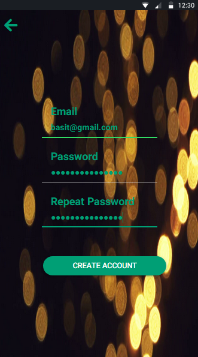

<h1> ionic login and signup with firebase  </h1>
This is the code for ionic login and signup with validation 
NOTE: palce your config details in app.firebase.config.ts in app folder 
#HERE ARE THE SCREEN SHOTS

